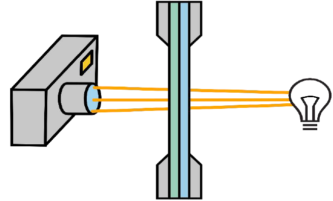
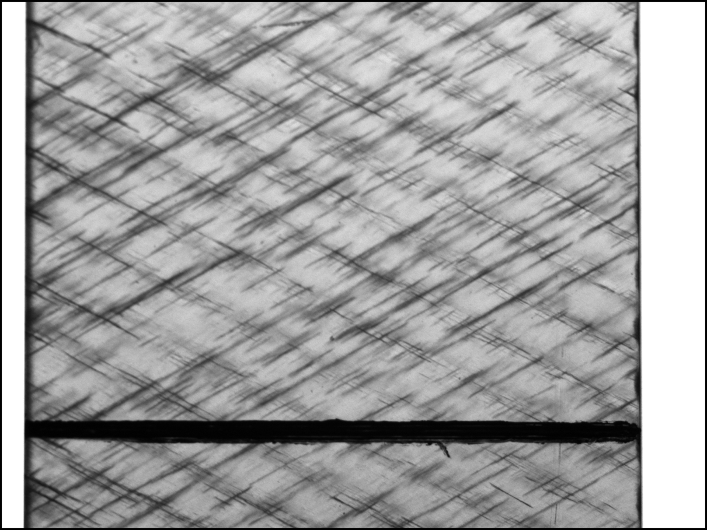

Crack Detection
===============

:mod:`~.imagestack` and :mod:`~.stack_operations` are not necessary restrained for the usage of
crack detection. :mod:`~.imagestack` provides the framework to conveniently process images
stacks. The module :mod:`~.crack_detection` provides the algorithms for crack detection.
In *CrackDect* the basic crack detection algorithms are implemented without image preprocessing since this step
depends on the image quality, imaging techinque etc.
Currently, three algorithms are implemented for the detection of **multiple straight cracks in a given direction**
in **grayscale** images.

.. py:currentmodule:: crack_detection

1. :func:`~.detect_cracks`
2. :func:`~.detect_cracks_glud`
3. :func:`~.detect_cracks_bender`

Theory
------

This package features algorithms for the detection of multiple straight cracks in a given direction.
The algorithms were developed for computing the crack density semi-transparent composites where
transilluminated white light imaging (TWLI) can be used as imaging technique.

This technique results in a bright image of the specimen with dark crack like this.

*CrackDect* works only on images similar to the one above, where cracks appear dark on a bright background.
The cracks must be straight, since the currently implemented algorithms work with masks and filters
to extract cracks in a specific direction. Therefore, it is possible to only detect one kind of cracks
and ignore cracks in other directions.

Glud´s algorithm
################

The following functions work with the basis of this algorithm:

1. :func:`~.detect_cracks`
2. :func:`~.detect_cracks_glud`

While :func:`~.detect_cracks` is a pure implementation of the
filter and processing steps, :func:`~.detect_cracks_glud` incorporates cracks detected in the n-1st image to
the nth image. Therefore all images must be related and without shift (see :ref:`shift_correction_label`).
:func:`~.detect_cracks_glud` is basically the full crack detection (without change detection) described by
`Glud et al. <https://www.sciencedirect.com/science/article/abs/pii/S0266353816300197>`_ whereas
:func:`~.detect_cracks` is only the "crack counting algorithm". :func:`~.detect_cracks` is more versatile and
detects cracks for each image in the given stack without influence of other images. If the position of
a crack changes in the image stack, use :func:`~.detect_cracks`.

This method from `Glud et al. <https://www.sciencedirect.com/science/article/abs/pii/S0266353816300197>`_
is designed to detect off axis tunneling cracks in composite materials.
It works on applying the following filters on the images:

1. **Gabor Filter:** The Gabor filter is applied which detects lines in a set direction. Cracks are only detected in
   the given direction. This allows to separate crack densities from different layers of the laminate.
2. **Threshold:** A threshold is applied on the result of the Gabor filter. This separates foreground
   and background in an image. The default is
   `Yen´s threshold <https://scikit-image.org/docs/dev/api/skimage.filters.html#skimage.filters.threshold_yen>`_.
   In the case of the crack detection it separates cracked and intact area. The
   Result of the threshold for the image is shown in the next image.
  .. figure:: images/pattern.png
      :width: 200
3. **Skeletonizing:** Since off axis tunneling cracks are aligned with the fibers they are straight. The white bands
   from the threshold are thinned to a width of one pixel. The algorithm which determines the start and end of
   each crack relies on only one pixel wide lines. The result of this skeletonizing for a part af the
   threshold image from above is shown in the next image. This
   The lines in this image are not continuous. The skeletonizing is done in a rotated coordinate system. This
   image is rotated back which creates this effect.
  .. figure:: images/skeleton.png
      :width: 200
4. **Crack Counting:** The cracks are counted in the skeletonized image. The skeletonized image is rotated into
   a coordinate system where all cracks are vertical (y-direction). Then a loop
   scans each pixel in each line of pixels in the image. If a crack is found, it follows it down the ydirection
   until the end of the crack. The coordinates of the beginning and end are saved. After
   one crack has been detected, it is removed from the image to avoid double detection when the
   loop runs over the next line of pixels. The following image shows this process.
  .. figure:: images/crack_counting.png
      :width: 300
5. **Crack Density:** The crack density is computed from the detected cracks with

   :math:`\rho_c = \frac{\sum_{i=1}^{n} L_i}{AREA}`

   with :math:`L_i` as the length of the i-th crack and :math:`AREA` as the area of the image.

6. **Threshold Density:** The threshold density is the area which is detected as cracked divided by the total image area.
   It simply is the ratio of white pixels to the total number of pixels in the threshold image. For series of related
   images from the same specimen where the cracks grow and new cracks initiate this measure can be taken as an sanity
   check. If the cracks grow too close to each other the white bands in the threshold image merge. Then the
   crack density fails to detect two individual cracks since the skeletonizing will result in only one line for two
   merged bands. The crack density starts to decrease even tho the threshold density still rises. This is a sign that the
   crack detection reached its limit and the cracks in the images are too close to each other.

The crack density, crack coordinates (start- and endpoints) and the threshold density are the main results of the crack
detection.

Disadvantages
*************

The usage of a computed threshold for the separation between cracks and no cracks is "greedy". This means,
cracks will be detected in the image. In images without cracks, artefacts will appear. This
problem is dampened with the use of
`Yen´s threshold <https://scikit-image.org/docs/dev/api/skimage.filters.html#skimage.filters.threshold_yen>`_.
`Otsu´s threshold <https://scikit-image.org/docs/dev/api/skimage.filters.html#skimage.filters.threshold_otsu>`_, as
used in the original paper is even more "greedy" and will always detect cracks even if there are none.

.. note::
    The results of this algorithm are sensitive to the input
    parameters especially to the parameters which control the gabor filter. Therefore it is a good practice to
    try the input parameters on a few images from the preprocessed stack before running the crack detection for the whole
    stack. The crack detection is resource intensive and can take a long time if lots of images are processed at
    once.

Bender´s algorithm
##################

is implemented as :func:`~.detect_cracks_bender`

This method introduced by
`Bender JJ <https://www.researchgate.net/publication/350967596_Effect_of_variable_amplitude_block_loading_on_intralaminar_crack_initiation_and_propagation_in_multidirectional_GFRP_laminate>`_
was also developed to detect off-axis cracks in fiber-reinforced polymers.
It can only be used for a series of shift-corrected images and needs a background image as reference
(the first image in the stack).
Therefore, it is not as versatile as :func:`~.detect_cracks` but it has shown good results for image series up to
high crack densities. It is also not "greedy" because a hard threshold is used.

The following filters and image processing steps are used to extract the cracks:

1. **Image History**: Starting form the second image in the stack, as the first is used as the background image, only
   darker pixels are taken form the image. This builds on the fact that cracks only result in dark pixels on the image
   and therefore, brighter pixels are only random noise.
2. **Image division** with background image (first image of the stack) to remove constant objects.
3. The image is divided by a blurred version of itself to remove the background.
4. A **directional Gaussian filter** is applied to diminish cracks in other than the given directions.
5. Images are **sharpened** with an `unsharp_mask <https://scikit-image.org/docs/stable/auto_examples/filters/plot_unsharp_mask.html>`_.
6. A **threshold** is applied to remove falsely identified cracks or artefacts with a weak signal.
7. **Morphological closing** of the image with a crack-like footprint to smooth the cracks and patch small discontinuities.
8. **Binarization** of the image. This results in an image with only cracks and background.
9. **Adding prior cracks**: The n-1st binarized image is added to add cracks already detected in prior images to the
   current image since cracks can only grow.
10. **Crack counting** with the skeletonizing and scanning method similar to the 4th point of `Glud´s algorithm`_.

.. note::
    This algorithm relies on the fact that cracks only grow. Also, cracks must not move between the images.
    Therefore, :ref:`shift_correction_label` is important for this algorithm. If this prerequisites are nor met,
    do not use this crack detection method.