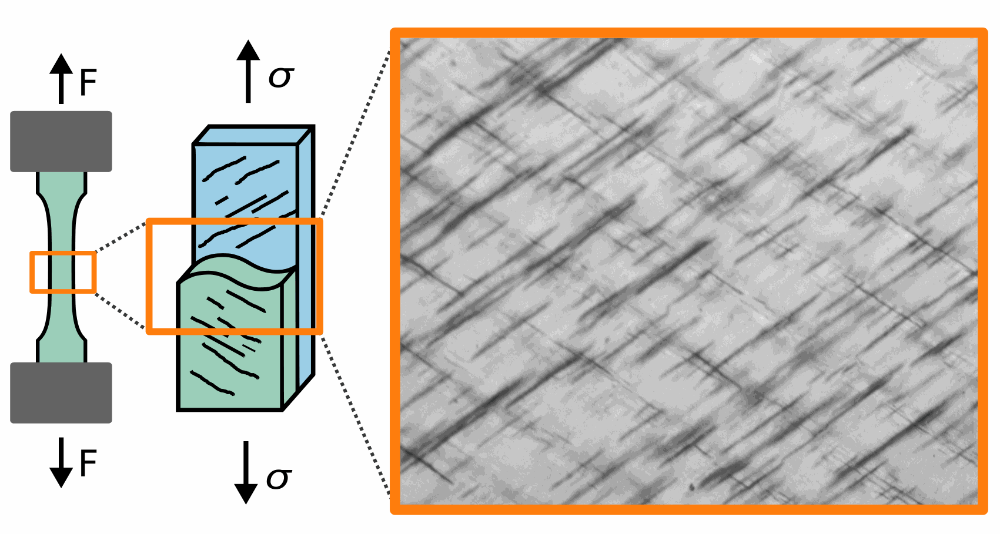

CrackDect: Expandable crack detection for composite materials.
==============================================================

This package provides an automated crack detection for tunneling off axis cracks in glass fiber reinforced materials.
It relies on image processing and works with transilluminated white light images (TWLI). The basis of the
crack detection method was first published by Glud et al. [1]_. This implementation is aimed to provide a modular
"batteries included" package for this method and extensions of it as well as image preprocessing functions.

Quick start
-----------

To install CrackDect, check at first the :ref:`Prerequisites` of your python installation.
Upon meeting all the criteria, the package can be installed with pip, or you can clone or download the repo.
If the installed python version or certain necessary packages are not compatible we recommend the use
of virtual environments by virtualenv or Conda. See
`the conda guide <https://conda.io/projects/conda/en/latest/user-guide/tasks/manage-environments.html#creating-an-environment-with-commands>`_
for infos about creating and managing Conda environments.

**Installation:**

Open a command line and check if python is available

.. code-block::

    $ python --version

This displays the version of the global python environment. If this does not return
the python version, something is not working and you need to fix your global python
environment.

If all the prerequisites are met CrackDect can be installed in the global environment via pip

.. code-block::

    $ pip install crackdect

:ref:`Quick Start` shows an illustrative example of the crack detection.

:ref:`Crack Detection` provides a quick theoretical introduction into the crack detection algorithm.

Prerequisites
-------------

It is recommended to use virtual environments (`anaconda <https://www.anaconda.com/>`_).
This package is written and tested in Python 3.8 and relies on here listed packages.

| `scikit-image <https://scikit-image.org/>`_ 0.18.1
| `numpy <https://numpy.org/>`_ 1.18.5
| `scipy <https://www.scipy.org/>`_ 1.6.0
| `matplotlib <https://matplotlib.org/>`_ 3.3.4
| `sqlalchemy <https://www.sqlalchemy.org/>`_ 1.3.23
| `numba <https://numba.pydata.org/>`_ 0.52.0
| `psutil <https://psutil.readthedocs.io/en/latest/>`_ 5.8.0

And if the visualization module is used `PyQt5 <https://pypi.org/project/PyQt5/>`_ is also needed.

Motivation
----------
Most algorithms and methods for scientific research are implemented as in-house code and not accessible for other
researchers. Code rarely gets published and implementation details are often not included in papers presenting the
results of these algorithms. Our motivation is to provide transparent and modular code with high level functions
for crack detection in composite materials and the framework to efficiently apply it to experimental evaluations.

.. toctree::
   :caption: Examples

   quickstart
   imagestack_intro
   preprocessing
   crack_detection

Contributing
------------

Clone the repository and add changes to it. Test the changes and make a pull request.

Modules
-------

.. currentmodule:: crackdect

.. autosummary::
    :toctree: generated
    :caption: User Documentation
    :template: module_template.rst

    imagestack
    image_functions
    stack_operations
    _io
    crack_detection
    visualization

Authors
-------
- Matthias Drvoderic

License
-------

This project is licensed under the MIT License

Indices and tables
------------------

* :ref:`genindex`

.. [1] J.A. Glud, J.M. Dulieu-Barton, O.T. Thomsen, L.C.T. Overgaard
   Automated counting of off-axis tunnelling cracks using digital image processing
   Compos. Sci. Technol., 125 (2016), pp. 80-89