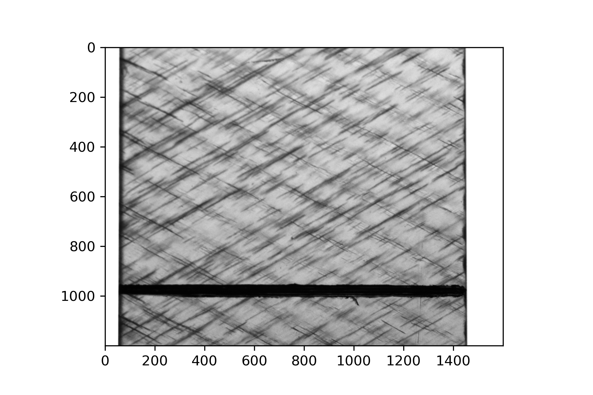
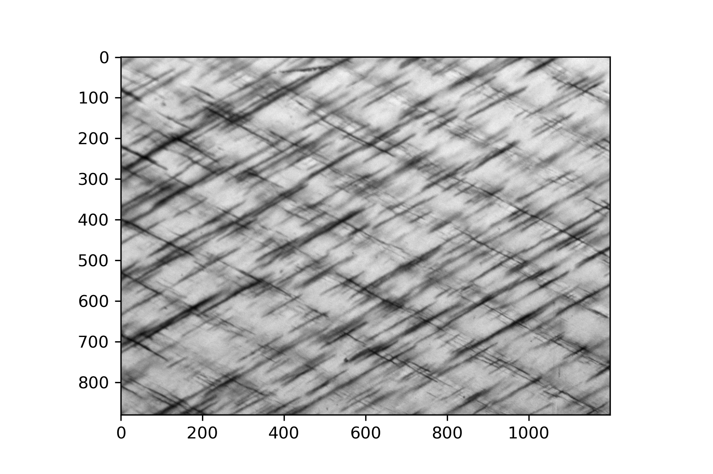
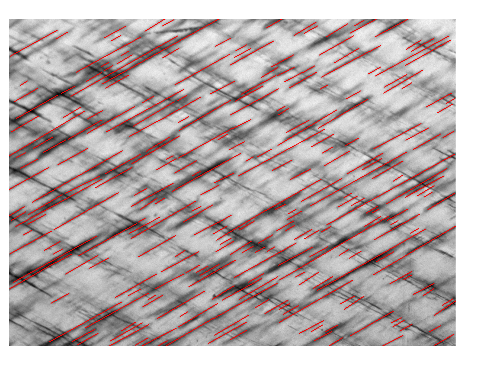

Quick Start
===========

.. py:currentmodule:: imagestack

Lets start with initialising an :class:`~.ImageStack`. Its a container object for a stack of images. The crack detection
works with this container objects to process the whole image stack at once.
It is also possible to work just with a list of images if no extra functionality from :class:`~.ImageStack` is needed.

Create an stack and add images to it. The images in this example can be downloaded
:download:`here <images/example_images.zip>`. Unpack the folder and set the working directory in the parent folder of
*example_images*.

.. code-block:: python

    >>> import numpy as np
    >>> import crackdect as cd
    >>> # read image paths from folder
    >>> paths = cd.image_paths('example_images')

    >>> # We want the dtype of the images to be np.float32 and only grayscale images.
    >>> stack = cd.ImageStack.from_paths(paths,  dtype=np.float32, as_gray=True)

The following image shows the last image from the stack. A lot of small and some bigger cracks are visible.
Also, the region of interest is only the middle part of the specimen without the edges of the specimen and the painted
black bar.

Before cutting to the desired shape a shift correction is necessary to align all images in a global
coordinate system. The following image shows the last image of the stack after the shift correction and the
cut to the region of interest.

.. code-block:: python

    >>> # shift correction to align all images in one coordinate system
    >>> cd.shift_correction(stack)

    >>> # The region of interest is form pixel 200-1400 in x and 20-900 in y
    >>> cd.region_of_interest(stack, 200, 1400, 20, 900)

The crack detection relies on the Gabor filter. Therefore, a few parameters must be set to create a suitable filter
kernel for the images.

- **theta:** The angle between the cracks and a vertical line.
- **crack_width:** Approximate width of the major detected cracks in pixels. This value is taken as the wavelength
  of the Gabor kernel.
- **ar:** The aspect ratio of the kernel. Since cracks are usually long and thin an aspect ratio bigger than 1
  should be chosen. A good compromise between speed and accuracy is 2. Too big aspect ratios can lead to false detection.
- **min_size:** The minimum length of detected cracks in pixels. Since small artifacts or noise can lead
  to false detection, this parameter provides an reliable filter.

.. code-block:: python

    >>> # crack detection
    >>> rho, cracks, thd = cd.detect_cracks(stack, theta=60, crack_width=10, ar=2, bandwidth=1, min_size=10)

The results can be plotted and insbected.

.. code-block:: python

    >>> # plot the crack density
    >>> import matplotlib.pyplot as plt
    >>> plt.plot(np.arange(len(stack)), rho)

.. figure:: plot_rho.png
    :width: 400

The crack density is growing with each image. To look if all cracks are detected lets look at the last image in the
stack.

.. code-block:: python

    # plot the background image and the associated cracks
    cd.plot_cracks(stack[-1], cracks[-1])

Nearly all cracks get detected. Some cracks are too close to each other and the crack detection can not distinguish
them. Cracks in other directions are not detected. This image has low contrast so it is hard to detect all
the cracks since some are quite faint compared to the background. There is also quite a lot of blur at some cracks.
This are the main problems with the crack detection. This image would benefit form an histogram equalization to
boost the contrast.