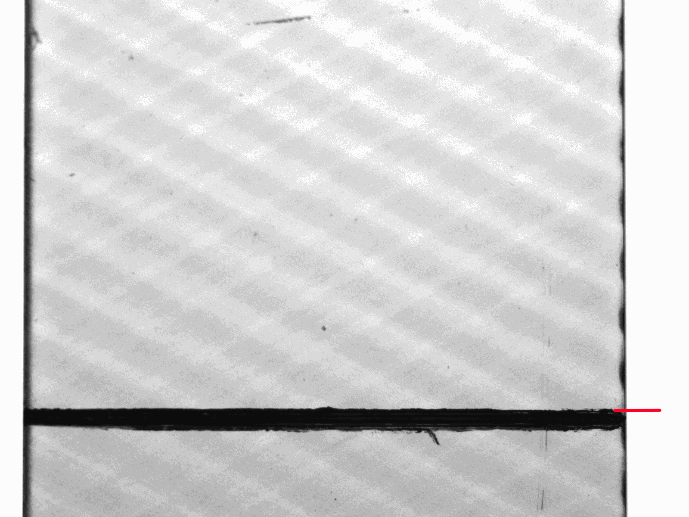
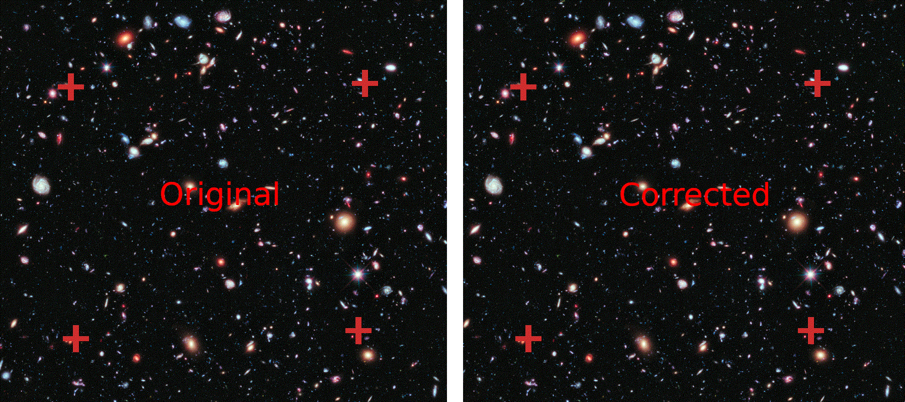
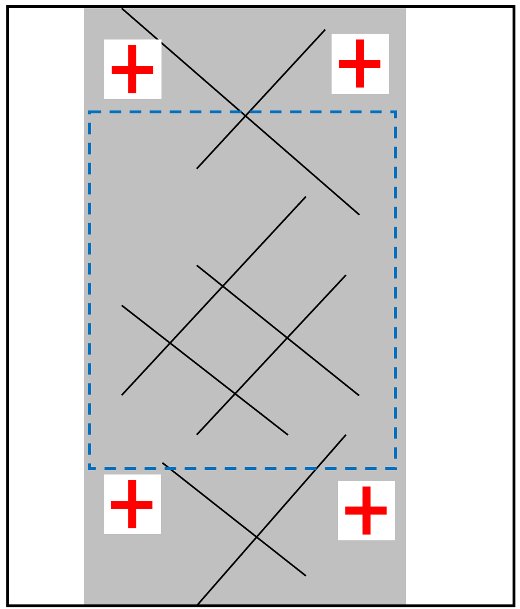

.. _shift_correction_label:

Shift Correction
================

In image series taken during tensile mechanical tests, it often appears that the specimen is moving
relative to the background like the specimen in this gif.

Since some crack detection algorithms work only with image series with no shift of the specimen all
must be aligned in a global coordinate system for them. Otherwise, these algorithms will compute wrong results.
Currently, the following functions need an aligned image stack:

.. py:currentmodule:: crack_detection

1. :func:`~.detect_cracks_glud`
2. :func:`~.detect_cracks_bender`

.. py:currentmodule:: imagestack

.. warning::
    All shift correction algorithms **only** take images with the **same** dimensionality as input. If
    the dimensionality of just one image differs it will result in an error. When using an :class:`~.ImageStack`
    make sure to ether only add images with the same dimensionality or when using :meth:`~.ImageStack.from_paths`
    to construct the stack, add kwargs to ensure all images are loaded the same way (
    `parameters for reading <https://imageio.readthedocs.io/en/stable/_autosummary/imageio.plugins.pillow_legacy.html#module-imageio.plugins.pillow_legacy>`_
    )!

Global Shift Correction
-----------------------

There are two methods to correct the global shift of an image and one to correct the shift as well as
distortion. The later can be used to correct images where the specimen show significant strain.

.. py:currentmodule:: stack_operations

#. :func:`~.biggest_common_sector`
#. :func:`~.shift_correction`

Both correct the shift of the image with global
`phase-cross-correlation <https://scikit-image.org/docs/stable/api/skimage.registration.html#skimage.registration.phase_cross_correlation>`_
and cut the image to the biggest common sector that no black borders appear.
:func:`~.biggest_common_sector` is more efficient but less accurate.

The following gif shows the corrected image series from above.

.. figure:: images/shift_corrected.gif
    :width: 400

With this corrected image series, crack detection methods that incorporate the history of the image are
applicable.

Shift-Distortion Correction
---------------------------

If the distortion due to strain of the specimen is significant, :func:`~.shift_distortion_correction`
can be used. This function tracks for subareas of the images to compute global shift, rotation and
relative movement between this subareas. The only prerequisite is that for distinct features are visible
throughout the whole image stack.

A best practice example would be to mark specimen at four positions
to enable reliable shift-distortion correction.

The red crosses are used to correct the shift and distortion of the image while the
blue dotted rectangle would mark the usable region of interest for the crack detection.

.. note::
   If shift and distortion are high it can be necessary to apply the correction twice in a row.

   Always check if the shift correction worked properly since its reliability depends on the
   quality of the images!